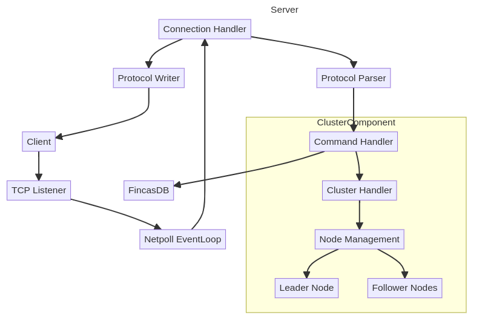
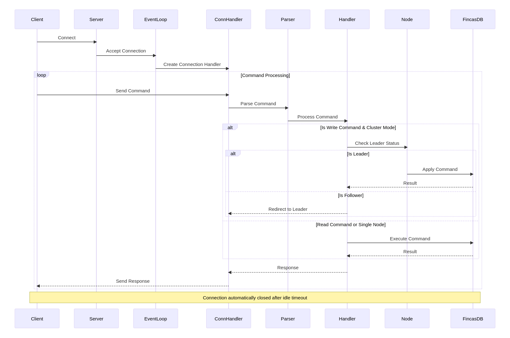

## 闲言碎语

前置参考：

- [FincasKV - 存储层设计与实现](./fincas-kv-storage-design-and-impl)
- [FincasKV - DB 层设计与实现](./fincas-kv-db-design-and-impl)

本篇对 FincasKV 的网络层实现做一些要点记录。

## RESP Protocol

FincasKV 中实现了简单的 RESP 协议，用于兼容 Redis 客户端，实现命令交互。

我定义了五种常用数据类型：`STRING(+)`, `ERROR(-)`, `INTEGER(:)`, `BULK($)`, `ARRAY(*)`。每个数据项以 `CRLF(\r\n)` 终止。

```go
const (
	STRING  byte = '+'
	ERROR   byte = '-'
	INTEGER byte = ':'
	BULK    byte = '$'
	ARRAY   byte = '*'
)

var (
    ErrInvalidRESP = errors.New("invalid RESP")
    CRLF           = []byte{'\r', '\n'}
)
```

对于其他类型直接使用 STRING 类型返回即可。

首先我们看看解析器部分。在这之前，我们需要先明确 redis-cli 使用RESP协议包装后返回到 server 的命令格式是什么样的。

看两条例子：

```bash
redis-cli -p 8911 set a b
redis-cli -p 8911 get a
```

set 命令按照 RESP 协议包装后的格式为：

```text
*3\r\n$3\r\nset\r\n$1\r\na\r\n$1\r\nb\r\n
```

get 命令按照 RESP 协议包装后的格式为：

```text
*2\r\n$3\r\nget\r\n$1\r\na\r\n
```

我们发现这里的返回格式都是以 '*' 开始，参考我们前面的定义，也就是说每条指令在这里都作为一个数组发送给 server。且整体只需要考虑 `ARRAY` `BULK` `INTEGER` 类型即可。

我们简单梳理一下 get 命令的解析过程: 

1. 读取 '*'，确定为数组类型，解析 INTEGER 确定数组长度。
2. 读取 '$'，确定为 BULK 类型，解析 INTEGER 确定字符串长度。
3. 读取字符串。
4. 重复 2-3 步，直到读取完整个数组。

然后直接看一下 coding 实现，比较简单：

```go
type Parser struct {
	reader *bufio.Reader
}

func (p *Parser) Parse() (*Command, error) {
	typ, err := p.reader.ReadByte()
	if err != nil { ... }

	switch typ {
	case ARRAY:
		return p.parseArray()
	default:
		return nil, ErrInvalidRESP
	}
}

func (p *Parser) parseArray() (*Command, error) {
	length, err := p.parseInteger()
	if err != nil { ... }

	if length < 1 { ... }

	command := &Command{
		Args: make([][]byte, length),
	}

	for i := 0; i < length; i++ {
		typ, err := p.reader.ReadByte()
		if err != nil { ... }

		if typ != BULK { ... }

		bulk, err := p.parseBulkString()
		if err != nil { ... }

		command.Args[i] = bulk
	}

	command.Name = string(command.Args[0])
	command.Args = command.Args[1:]

	return command, nil
}

func (p *Parser) parseBulkString() ([]byte, error) {
	length, err := p.parseInteger()
	if err != nil { ... }

	if length < 0 { ... }

	bulk := make([]byte, length)
	if _, err := io.ReadFull(p.reader, bulk); err != nil { ... }

	crlf := make([]byte, 2)
	if _, err := io.ReadFull(p.reader, crlf); err != nil { ... }

	if !bytes.Equal(crlf, CRLF) { ... }

	return bulk, nil
}

func (p *Parser) parseInteger() (int, error) {
	line, err := p.reader.ReadString('\n')
	if err != nil { ... }

	if len(line) < 3 || line[len(line)-2] != '\r' { ... }

	n, err := strconv.Atoi(line[:len(line)-2])
	if err != nil { ... }

	return n, nil
}
```

然后看看写入器部分，用于将结果包装成 RESP 协议后写入到客户端，还是先看一下基本的格式（以 STRING 举例）：

假设我执行了 `set a b` 需要返回 `OK`，那么按照 RESP 协议包装后的格式为：`+OK\r\n`。

现在我们可以很容易的写出以下代码：

```go
func (w *Writer) WriteString(s string) error {
	_, err := w.writer.Write([]byte{STRING})
	if err != nil {
		return err
	}

	_, err = w.writer.Write([]byte(s))
	if err != nil {
		return err
	}

	_, err = w.writer.Write(CRLF)
	return err
}
```

ERROR 和 INTEGER 同理。对于 BULK 类型略有不同，我们需要先写入长度，然后写入字符串，最后写入 CRLF。而数组则是先写入长度，然后写入CRLF，之后追加若干个 BULK。这里不做展开。

## Network

首先我们从整体出发看看 FincasKV 的网络层的结构。



1. 连接建立:
- 客户端（Client）向服务器（Server）发起连接请求。
- 服务器接收连接并将其传递给事件循环（EventLoop）进行处理。
2. 创建连接处理器:
- 事件循环为每个连接创建一个连接处理器（ConnHandler），负责管理与客户端的交互。
3. 命令处理循环:
- 在命令处理的循环中，客户端向连接处理器发送命令。
- 连接处理器将命令传递给协议解析器（Parser）进行解析。
4. 解析命令:
- 协议解析器解析命令并将其传递给命令处理器（Handler）进行处理。
5. 判断命令类型:
- 写命令处理:
  - 如果是写命令且系统处于集群模式，命令处理器将检查当前节点是否为领导者（Leader）。
  - 如果是领导者，命令被应用到 DB 层（FincasDB）。
  - 如果是跟随者（Follower），则连接处理器会将请求重定向到领导者节点。
- 读命令处理:
  - 如果是读命令或单节点模式，则直接在数据库中执行命令。
6. 返回响应:
- 命令处理器将结果返回给连接处理器。
- 连接处理器将响应发送回客户端。

同时可以参考以下时序图：



下面看一下 Connection 的代码摘要：

```go
type Connection struct {
	conn   netpoll.Connection
	parser *protocol.Parser
	writer *protocol.Writer
	ctx    context.Context
	cancel context.CancelFunc
	closed bool
	mu     sync.RWMutex
}

func New(conn netpoll.Connection) *Connection {
	ctx, cancel := context.WithCancel(context.Background())

	c := &Connection{
		conn:   conn,
		parser: protocol.NewParser(conn),
		writer: protocol.NewWriter(conn),
		ctx:    ctx,
		cancel: cancel,
	}

	return c
}

func (c *Connection) Close() error {
	c.mu.Lock()
	defer c.mu.Unlock()

	if c.closed {
		return nil
	}

	c.closed = true
	c.cancel()
	return c.conn.Close()
}

func (c *Connection) IsClosed() bool {
	c.mu.RLock()
	defer c.mu.RUnlock()
	return c.closed
}

func (c *Connection) ReadCommand() (*protocol.Command, error) {
	c.mu.Lock()
	defer c.mu.Unlock()

	cmd, err := c.parser.Parse()
	if err != nil {
		return nil, err
	}

	return cmd, nil
}

func (c *Connection) WriteString(s string) error {
	c.mu.Lock()
	defer c.mu.Unlock()

	err := c.writer.WriteString(s)
	if err != nil {
		return err
	}

	return nil
}

// 以下方法同理

func (c *Connection) WriteError(err error) error { ... }

func (c *Connection) WriteInteger(n int64) error { ... }

func (c *Connection) WriteBulk(b []byte) error { ... }

func (c *Connection) WriteArray(arr [][]byte) error { ... }
```

Server:

```go
type Config struct {
	Addr           string
	IdleTimeout    time.Duration
	MaxConnections int
	ReadTimeout    time.Duration
	WriteTimeout   time.Duration
}

type Server struct {
	cfg       *Config
	db        *database.FincasDB
	handler   *handler.Handler
	eventLoop netpoll.EventLoop

	conns  sync.Map
	connWg sync.WaitGroup

	stats *Stats

	ctx     context.Context
	cancel  context.CancelFunc
	closed  bool
	closeMu sync.RWMutex

	metricsTicker *time.Ticker
	metricsCancel context.CancelFunc

	node *node.Node
}

func New(db *database.FincasDB, address *string) (*Server, error) {
	var (
		addr           = ":8911"
		idleTimeout    = 5 * time.Second
		maxConnections = 1000
		readTimeout    = 10 * time.Second
		writeTimeout   = 10 * time.Second
	)
	
	// 省略配置获取部分

	cfg := &Config{
		Addr:           addr,
		IdleTimeout:    idleTimeout,
		MaxConnections: maxConnections,
		ReadTimeout:    readTimeout,
		WriteTimeout:   writeTimeout,
	}

	ctx, cancel := context.WithCancel(context.Background())

	s := &Server{
		cfg:     cfg,
		db:      db,
		handler: handler.New(db),
		stats:   &Stats{StartTime: time.Now()},
		ctx:     ctx,
		cancel:  cancel,
	}

	eventLoop, err := netpoll.NewEventLoop(
		func(ctx context.Context, conn netpoll.Connection) error {
			return s.handleConnection(ctx, conn)
		},
		netpoll.WithOnPrepare(func(connection netpoll.Connection) context.Context {
			return context.Background()
		}),
		netpoll.WithIdleTimeout(idleTimeout),
		netpoll.WithReadTimeout(readTimeout),
		netpoll.WithWriteTimeout(writeTimeout),
	)
	if err != nil {
		return nil, fmt.Errorf("failed to create netpoll eventLoop: %v", err)
	}

	s.eventLoop = eventLoop

	return s, nil
}

func (s *Server) Start() error {
	s.closeMu.Lock()
	if s.closed {
		s.closeMu.Unlock()
		return fmt.Errorf("server is already closed")
	}
	s.closeMu.Unlock()

	s.startMetricsCollection()

	listener, err := netpoll.CreateListener("tcp", s.cfg.Addr)
	if err != nil {
		return fmt.Errorf("failed to create listener: %v", err)
	}

	log.Printf("listening on %s", s.cfg.Addr)
	if err := s.eventLoop.Serve(listener); err != nil {
		return fmt.Errorf("failed to start eventLoop: %v", err)
	}

	return nil
}

func (s *Server) Stop() error {
	s.closeMu.Lock()
	if s.closed {
		s.closeMu.Unlock()
		return fmt.Errorf("server already closed")
	}
	s.closed = true
	s.closeMu.Unlock()

	s.cancel()

	if s.metricsCancel != nil {
		s.metricsCancel()
	}

	if s.node != nil {
		if err := s.node.Shutdown(); err != nil {
			log.Printf("failed to shutdown node: %v", err)
		}
	}

	s.conns.Range(func(key, value interface{}) bool {
		if c, ok := value.(conn.Connection); ok {
			c.Close()
		}
		return true
	})

	s.connWg.Wait()

	return s.eventLoop.Shutdown(context.Background())
}

func (s *Server) handleConnection(ctx context.Context, c netpoll.Connection) error {
	if atomic.LoadInt64(&s.stats.ConnCount) >= int64(s.cfg.MaxConnections) {
		c.Close()
		return fmt.Errorf("max connections reached")
	}

	connection := conn.New(c)
	s.conns.Store(c, connection)
	s.connWg.Add(1)

	defer func() {
		connection.Close()
		s.conns.Delete(c)
		s.connWg.Done()
	}()

	for {
		select {
		case <-ctx.Done():
			return nil
		default:
			start := time.Now()
			cmd, err := connection.ReadCommand()
			if err != nil {
				if errors.Is(err, netpoll.ErrConnClosed) {
					return nil
				}
				log.Printf("failed to read command: %v", err)
				continue
			}

			// 处理 cluster 命令
			if strings.ToUpper(cmd.Name) == "CLUSTER" {
				if err := s.handleClusterCommand(connection, cmd); err != nil {
					log.Printf("failed to handle cluster command: %v", err)
				}
				continue
			}

			// 禁止非Leader节点处理写操作
			cmdP, ok := isWriteCommand(cmd.Name)
			if ok && s.node != nil && !s.node.IsLeader() {
				leaderAddr := s.node
				return connection.WriteError(fmt.Errorf("redirect to leader: %s", leaderAddr))
			}

			if err := s.handler.Handle(connection, cmd); err != nil {
				s.stats.IncrErrorCount()
				log.Printf("failed to handle command: %v", err)
			} else if s.node != nil {
				err := s.node.Apply(command.New(cmdP.CmdType, cmdP.Method, cmd.Args))
				if err != nil {
					return fmt.Errorf("failed to apply command: %v", err)
				}
			}

		}
	}
}

func (s *Server) initCluster(conf *node.Config) error {
	n, err := node.New(s.db, conf)
	if err != nil { ... }

	s.node = n
	return nil
}

// 以下方法用于判断是否为写命令以及和 Cluster Handler 相对应
type cmdPair struct {
	CmdType command.CmdTyp
	Method  command.MethodTyp
}

func isWriteCommand(cmd string) (cmdPair, bool) {
	wCmds := map[string]cmdPair{
		"SET": {command.CmdString, command.MethodSet}, "DEL": {command.CmdString, command.MethodDel}, "INCR": {command.CmdString, command.MethodIncr}, "INCRBY": {command.CmdString, command.MethodIncrBy},
		"DECR": {command.CmdString, command.MethodDecr}, "DECRBY": {command.CmdString, command.MethodDecrBy}, "APPEND": {command.CmdString, command.MethodAppend}, "GETSET": {command.CmdString, command.MethodGetSet},
		"SETNX": {command.CmdString, command.MethodSetNX}, "MSET": {command.CmdString, command.MethodMSet},
		"HSET": {command.CmdHash, command.MethodHSet}, "HMSET": {command.CmdHash, command.MethodHMSet}, "HDEL": {command.CmdHash, command.MethodHDel}, "HINCRBY": {command.CmdHash, command.MethodHIncrBy},
		"HINCRBYFLOAT": {command.CmdHash, command.MethodHIncrByFloat}, "HSETNX": {command.CmdHash, command.MethodHSetNX},
		"LPUSH": {command.CmdList, command.MethodLPush}, "RPUSH": {command.CmdList, command.MethodRPush}, "LPOP": {command.CmdList, command.MethodLPop}, "RPOP": {command.CmdList, command.MethodRPop},
		"LTRIM": {command.CmdList, command.MethodLTrim}, "LINSERT": {command.CmdList, command.MethodLInsert},
		"SADD": {command.CmdSet, command.MethodSAdd}, "SREM": {command.CmdSet, command.MethodSRem}, "SPOP": {command.CmdSet, command.MethodSPop}, "SMOVE": {command.CmdSet, command.MethodSMove},
		"ZADD": {command.CmdZSet, command.MethodZAdd}, "ZREM": {command.CmdZSet, command.MethodZRem}, "ZINCRBY": {command.CmdZSet, command.MethodZIncrBy},
		"ZREMRANGEBYRANK": {command.CmdZSet, command.MethodZRemRangeByRank}, "ZREMRANGEBYSCORE": {command.CmdZSet, command.MethodZRemRangeByScore},
	}
	val, ok := wCmds[strings.ToUpper(cmd)]
	return val, ok
}
```

Handler 简要代码：

```go
type Handler struct {
	db *database.FincasDB
}

func New(db *database.FincasDB) *Handler {
	return &Handler{
		db: db,
	}
}

func (h *Handler) Handle(conn *conn.Connection, cmd *protocol.Command) error {
    switch strings.ToUpper(cmd.Name) {
    case "PING":
        return h.handlePing(conn, cmd)
    // 省略其他指令
    default:
        return conn.WriteError(errors.New("unknown command"))
    }
}

func (h *Handler) handlePing(conn *conn.Connection, cmd *protocol.Command) error {
    if len(cmd.Args) > 1 {
        return conn.WriteError(ErrWrongArgCount)
    }

    if len(cmd.Args) == 1 {
        return conn.WriteString(fmt.Sprintf("PONG %s", string(cmd.Args[0])))
    }

    return conn.WriteString("PONG")
}

// 省略其他指令 handle
```

对于分布式支持更多的是基于 hashicorp/raft 库对于网络层的扩展，且 FSM 部分和 Handler 有些重复，这里可以直接阅读 Raft 论文后直接看 cluster 包下的代码即可。后续会对 FSM 进行一些调整，复用 Network Handler。

---

结束。