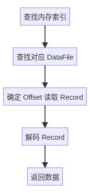
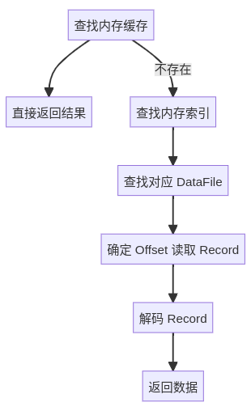

## 闲言碎语

在去年写我的第一版简历的时候做过一个项目 FinnKV，一个基于 Bitcask 存储模型实现的 KV 存储，当时做的比较简陋，不出意外的，在投递过程中反馈也比较差，于是趁着这个寒假的时间重构了一下项目，引入了一些新的内容，在此做一些记录。

重构后的项目命名为 FincasKV，一个基于 Bitcask 存储模型的分布式 KV 存储。

仓库地址：[FincasKV](https://github.com/FinnTew/FincasKV)

## Bitcask

Bitcask 是一种高效的键值存储模型，采用类 LSM 结构。本质上 Bitcask 就是一个具有固定结构、支持内存索引，Append Only 的日志文件目录。通过内存索引中保存的键到Offset的映射相关的信息，实现高效查找。

### 数据文件(DataFile)

如上所述，每个 DataFile 都是一个 Append Only 的日志文件，用于保存键值对极其相关的元信息，其中每条日志(Record)呈如下结构：

```go
type KVItem struct {
	Key   []byte
	Value []byte
}

type Record struct {
	Timestamp int64
	Checksum  uint64
	Flags     uint32
	KVItem
}
```

实际写入时还应该存储 CRC 校验和，用于校验数据的完整性。不难想到 CRC 是在 Record 构建完整后进行写入操作时计算，以及在读出时确认位置后读取 KV 前校验，所以 Record 中并不需要添加 CRC 字段。

一个 Bitcask 实例包含多个 DataFile，但只有一个为 Active DataFile，且仅有 Active DataFile 可变，允许追加写入操作，其与的 Old DataFile 不可变，只允许读操作。

在当前 Active DataFile 的大小到达阈值的时候，我们需要将其关闭，并创建新的日志文件作为 Active DataFile。

还有一种会轮转 Active DataFile 的情况，在 Bitcask 中，我们认为，只要日志文件被关闭了，无论是否主动关闭，我们都将其视为 Old DataFile，永远不再 Reopen 允许写入操作。

### 内存索引

前面提到过 Bitcask 内存索引存储了键到 Offset 的映射信息，用于快速查找。每条索引称为一个 Entry，结构如下：

```go
type Entry struct {
	FileID    int
	Offset    int64
	Size      uint32
	Timestamp int64
}
```

### Put, Get, Del

Bitcask 中所有的写操作都以追加日志的方式进行，但是显然新增/修改和删除操作实际上并不相同，所以我们需要一种区分二者的方式。论文中提到对于删除操作使用墓碑机制。

注意到 Record 中已经有 Flag 字段，我们还需定义如下两种状态标记：

```go
const (
	FlagNormal uint32 = iota // 表示新增或者修改操作，这里二者并不需要区分，读取时取最近一条即可
	FlagDeleted // 表示删除操作
)
```

处理完以上问题后，Put 和 Del 的逻辑就显而易见了：

- Put：构建 Record，设置 Flag 为 FlagNormal，追加写入 Active DataFile，新增/更新对应键的内存索引。
- Del：构建 Record，设置 Flag 为 FlagDeleted，追加写入 Active DataFile，删除对应键的内存索引。

而对于 Get，我们参考 Entry 结构，不难发现流程如下：

1. 通过键获取对应的 Entry。
2. 通过 Entry 中的 FileID 确定目标 DataFile。
3. 假设整个文件为 data[:]，那么我们只需要读出 data[Entry.Offset:Entry.Offset + Entry.Size] 即为需要的 Record。
4. 不难算出 HeaderSize = timestamp(8) + flags(4) + keyLen(4) + valueLen(4) = 20 bytes，而 CRC 校验和为 8 bytes，所以 Record 实际大小为 28 bytes + len(Key) + len(Value)。
5. DataFile 中每条 Record 按照 "Header | Key | Value | CRC" 这样存储，所以我们读出 data[Entry.Offset + HeaderSize:Entry.Offset + Entry.Size - 8] 即为 "Key | Value"。 

### Merge

到这里，Merge 操作就很容易了，论文指出 Merge 即为遍历所有有效键值对，将其写入到新的 DataFile 中，全部完成后删除原本的 DataFile。

有效键值对在这里即为当前内存缓存中的键对应的键值对，此时 Merge 的流程已经很清晰了：

1. 创建 MergeDir，在其中创建新的 Active DataFile。
2. 遍历内存索引的键，依次 Get，并构建新的 Record 写入 MergeDir 中的 Active DataFile。
3. 全部完成后，删除 DataDir，将 MergeDir 重命名作为新的 DataDir。

---

至此，基本的 Bitcask 模型已经实现了，下面我们考虑一些优化。

## FileManager - AsyncWrite

Bitcask 是一个依赖文件系统的存储模型，那我们首先可以想到，对写入操作进行优化，也就是这里提到的异步写。

在此之前我先对现有的代码结构进行了一些调整，注意到对于文件的操作可以解耦，所以我将 rotate, Write, Read, Sync 以及 Encode/Decode 这些操作解耦出来，实现了一个 FileManager，方便之后优化改进。

然后是异步写的实现，我们知道，Golang 的并发原语是非常强大的，我们可以依据此很轻松的将写入操作进行异步化。

首先定义对应的结构：

```go
type AsyncWriteReq struct {
	DataByte []byte
	Resp     chan AsyncWriteResp
}

type AsyncWriteResp struct {
	Entry storage2.Entry
	Err   error
}
```

然后是实现：

```go
func (fm *FileManager) WriteAsync(r *storage2.Record) <-chan AsyncWriteResp {
	result := make(chan AsyncWriteResp, 1)

	// 编码成二进制
	data, err := encodeRecord(r)
	if err != nil {
		// 如果编码失败，直接返回错误
		go func() {
			result <- AsyncWriteResp{Err: err}
			close(result)
		}()
		return result
	}

	req := AsyncWriteReq{
		DataByte: data,
		Resp:     make(chan AsyncWriteResp, 1),
	}

	select {
	case fm.writeChan <- req:
		// 异步读出写结果再转发
		go func() {
			res := <-req.Resp
			result <- res
			close(result)
		}()
	case <-fm.stopChan:
		// 如果已经关闭，则立即返回错误
		go func() {
			result <- AsyncWriteResp{Err: err_def.ErrDBClosed}
			close(result)
		}()
	}
	return result
}

// processWrites 消费 fm.writeChan，执行实际写入
func (fm *FileManager) processWrites() {
	defer fm.wg.Done()
	for {
		select {
		case req, ok := <-fm.writeChan:
			if !ok {
				return
			}
			entry, err := fm.syncWrite(req.DataByte)
			req.Resp <- AsyncWriteResp{Entry: entry, Err: err}
			close(req.Resp)
		case <-fm.stopChan:
			return
		}
	}
}

// syncWrite 内部真正执行写入的函数
func (fm *FileManager) syncWrite(data []byte) (storage2.Entry, error) {
	for {
		current := fm.GetActiveFile()
		if current == nil { ... }
		if current.Closed.Load() {
			// 已关闭，进行轮转
			_, err := fm.rotateFile()
			if err != nil { ... }
			continue
		}

		// 检查剩余空间，如果不够则轮转
		offsetNow := current.Offset.Load()
		if offsetNow+int64(len(data)) > fm.maxFileSize {
			_, err := fm.rotateFile()
			if err != nil { ... }
			continue
		}

		// 计算写入起始位置
		newOffset := current.Offset.Add(int64(len(data)))
		writePos := newOffset - int64(len(data))

		// 执行写入
		n, err := current.File.WriteAt(data, writePos)
		if err != nil || n != len(data) {
			// 写失败，则关闭当前文件并轮转
			_ = current.File.Close()
			current.Closed.Store(true)

			_, rotateErr := fm.rotateFile()
			if rotateErr != nil { ... }
			return storage2.Entry{}, err_def.ErrWriteFailed
		}

		// 写成功，返回对应的索引信息
		return storage2.Entry{
			...
		}, nil
	}
}
```

如上，我们通过 writeChan 进行异步写，然后在 processWrites 中消费 writeChan，将实际写操作异步延迟到 syncWrite 中执行。

在写入 writeChan 成功时直接返回结果，避免了阻塞等待，有效提高效率。

## Multi-Type Shard MemIndex

首先规定我们所有的内存索引数据结构需要满足以下接口定义：

```go
type MemIndex[KeyType comparable, ValueType any] interface {
	Put(key KeyType, value ValueType) error
	Get(key KeyType) (ValueType, error)
	Del(key KeyType) error
	Foreach(f func(key KeyType, value ValueType) bool) error
	Clear() error
}
```

目前为存储层也就是 Bitcask 实现了多类型的内存索引，包括：

- BTree: 适合大数据集，需要键排序的场景。
- SkipList: 适合数据量适中，且数据频繁变化的场景。
- SwissTable: 适合高并发场景，以及内存限制严苛且需要高效查找的场景。

可以通过配置文件自由的配置使用哪种内存索引数据结构，以及相关的对应参数。

然后我们进一步进行优化，即实现 Shard MemIndex。

定义如下基本结构：

```go
type MemIndexShard[K comparable, V any] struct {
	shardCount int
	shards     []storage2.MemIndex[K, V] 
	sync.RWMutex
}
```

然后是实例化部分：

```go
func NewMemIndexShard[K comparable, V any](\* ... *\) *MemIndexShard[K, V] {
    index := &MemIndexShard[K, V]{
        shardCount: shardCount,
        shards:     make([]storage2.MemIndex[K, V], shardCount),
    }

    for i := 0; i < shardCount; i++ {
        switch memIndexType {
        case storage2.BTree:
            if btreeDegree <= 0 { ... }
            if btreeLessFunc == nil { ... }
            index.shards[i] = NewBTreeIndex[K, V](btreeDegree, btreeLessFunc)
        case storage2.SkipList:
            if skipListLessFunc == nil { ... }
            if skipListRandSource == nil {
                index.shards[i] = NewSkipListIndex[K, V](skipListLessFunc)
            } else {
                index.shards[i] = NewSkipListIndex[K, V](skipListLessFunc, WithRandSource(skipListRandSource))
            }
        case storage2.SwissTable:
            if swissTableSize <= 0 {
                swissTableSize = 1 << 10
            }
            index.shards[i] = NewSwissIndex[K, V](swissTableSize)
        default:
            log.Fatal("Unsupported memIndex type")
        }
    }

    return index
}
```

然后是分片操作，我们对 key 进行哈希然后对 shardCount 取模，得到对应的分片索引：

```go
func (s *MemIndexShard[K, V]) getShard(key K) storage2.MemIndex[K, V] {
	h := fnv.New32a()
	h.Write([]byte(fmt.Sprintf("%v", key)))
	return s.shards[h.Sum32()%uint32(s.shardCount)]
}
```

然后就是 Put，Get，Del 操作，不难想到这里的流程如下：

1. getShard 获取 key 对应的分片。
2. shard 执行 Put，Get，Del 操作。
3. 返回结果。

这里不多赘述，Foreach 操作也是同理，唯一的区别是需要遍历所有 shard。

最后我们想想 Clear 操作，它是可以对所有 shard 并发执行的，所以实现上稍微有些不一样：

```go
func (s *MemIndexShard[K, V]) Clear() error {
	s.Lock()
	defer s.Unlock()

	var wg sync.WaitGroup
	errChan := make(chan error, len(s.shards))
	defer close(errChan)

	for _, shard := range s.shards {
		wg.Add(1)
		go func(s storage2.MemIndex[K, V]) {
			defer wg.Done()
			if err := s.Clear(); err != nil {
				errChan <- err
			}
		}(shard)
	}
	wg.Wait()

	select {
	case err := <-errChan:
		return fmt.Errorf("could not clear index: %w", err)
	default:
		return nil
	}
}
```

## LRUCache & BloomFilter

首先我们想想，目前的实现下，我们读取所有数据都需要进行以下流程：



每次读取都需要进行磁盘 IO，显然效率非常低下。但是在一个系统中，显然不可能所有数据被使用的概率都是等可能的，必然存在有一些热点数据的情况。

那么对于这些使用频率较高的热点数据，我们考虑使用缓存来进行加速。

引入缓存后，我们读取时会先询问缓存中是否存在这个数据，如果存在则直接返回，否则再去磁盘中读取。这样就可以减少一些不必要的磁盘 IO，提高效率。

现在的流程如下：



下一步就是怎么确定哪些数据是热点数据。

我们这里使用 LRU 实现缓存，在 LRU 中，我们认为最近被访问过的数据将有更高的概率被再次访问，所以我们将这些数据作为热点数据放到缓存中。

这里对于 LRU 的实现不做赘述。

然后我们继续考虑，是否可以进一步减少不必要的磁盘 IO。

此前我们引入了内存缓存，但缓存是有容量限制的，现在我们考虑，假设现在有大量恶意的请求，这些请求的 key 都不在内存缓存中或者不在整个存储中，那么这些请求将会全部穿透到磁盘中，导致大量的磁盘 IO。

为了避免这种情况，我们引入 BloomFilter 来进行过滤，对于确定不存在的 key，我们直接返回，对于可能存在的 key，我们再去缓存或者磁盘中查询。

这样就避免了我们上面提到的场景可能会出现的问题。

这里额外提一个自认为比较有意思的实现：

Bitcask 中的数据量是不确定的，但 BloomFilter 需要一个确定的最大容量。但是我又不想在初始设置一个极大的容量，这样显然会造成浪费。

然后想到之前学习的 Go Slice 的实现，将它的扩容机制稍微修改应用在了这里：当前 BloomFilter 填充率大于 0.75 时，扩容一倍。

这部分实现如下：

```go
// 检查是否需要扩容
if bf.autoScale && float64(atomic.LoadUint64(&bf.n))/float64(bf.m) > growthThreshold {
	if err := bf.grow(); err != nil {
		return fmt.Errorf("bloom filter grow failed: %v", err)
	}
}
```

```go
func (bf *ShardedBloomFilter) grow() error {
	newShardCount := uint32(len(bf.shards) * growthFactor)
	newShardBits := bf.shardBits * growthFactor
	newShards := make([]shard, newShardCount)

	for i := range newShards {
		newShards[i].bits = make([]uint64, newShardBits/64)
	}

	for i := 0; i < len(bf.shards); i++ {
		shard := &bf.shards[i]
		shard.Lock()
		shard.bits = make([]uint64, newShardBits/64)
		shard.Unlock()
	}

	bf.shards = newShards
	bf.m = uint64(newShardCount) * uint64(newShardBits)
	bf.shardMask = newShardCount - 1
	bf.shardBits = newShardBits

	return nil
}
```

至此，存储层的大部分内容就完成了。Bye~