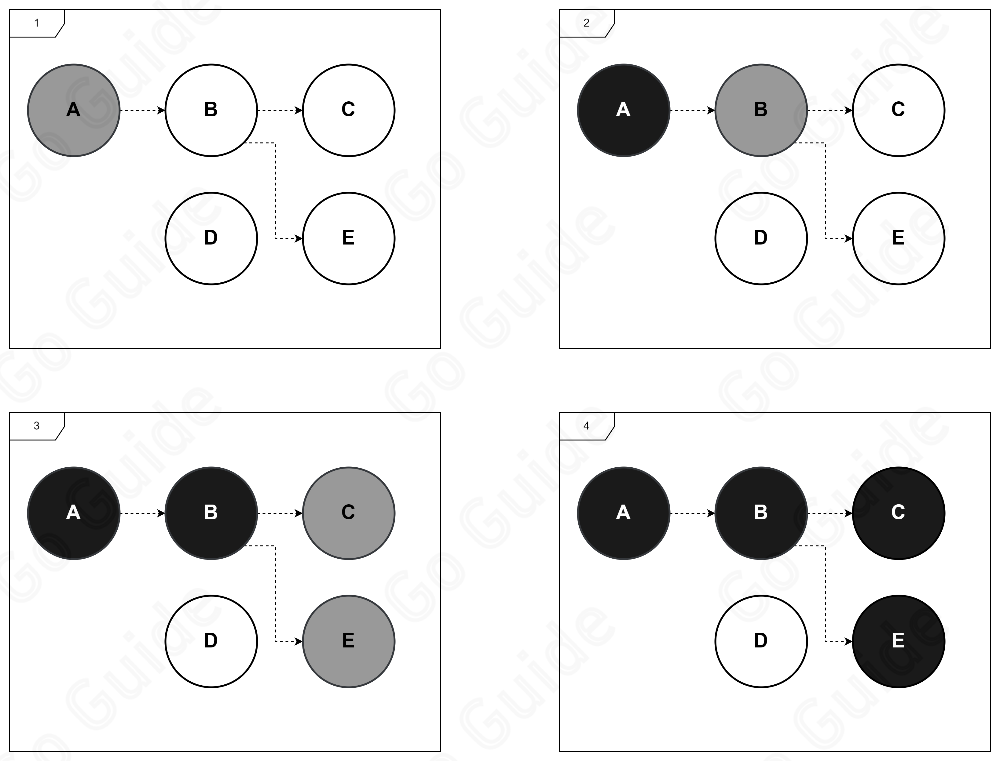
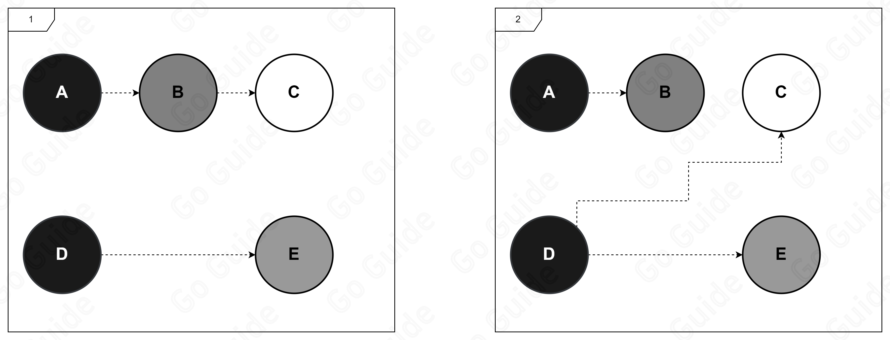
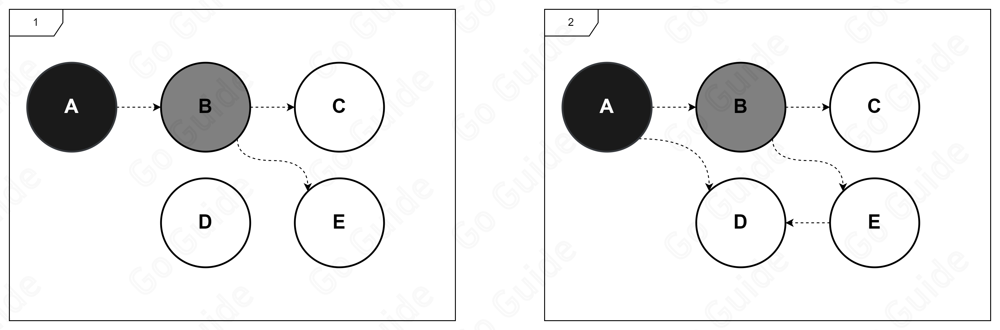
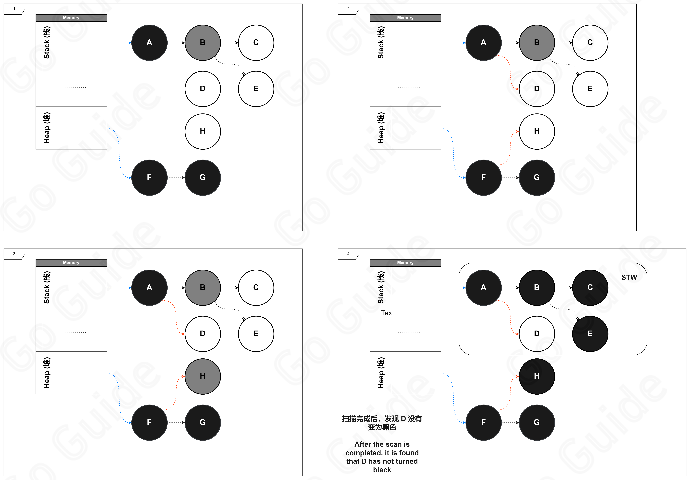
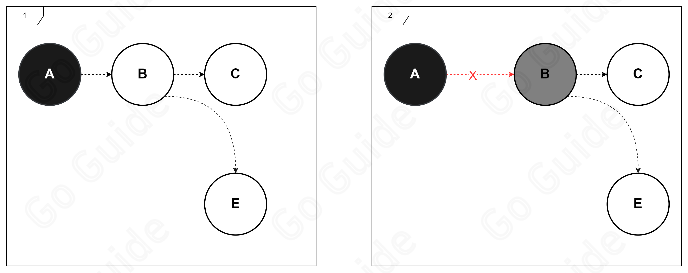

## 常见垃圾回收策略

### 引用计数(Reference Counting)

引用计数算法是一种简单的垃圾回收算法，C++ 中 `std::shared_ptr` 就使用了这种算法。

**基本思想**：给对象添加一个引用计数字段，每当有一个地方引用它时，计数加1，引用失效时，计数减1,当计数为0时，意味着对象不再被使用，可以对其进行回收。

优点是：
- 不需要从根节点遍历，相对容易查找。
- 每个对象知道自己被引用的次数，一旦引用计数为0，就将其连接到空闲链表上等待回收。
- 在 Mutator 更新引用计数时就会触发垃圾回收，不需要等待内存耗尽的时机，因此不会出现程序暂停时间过久的问题。

缺点也比较明显：
- 无法解决循环引用问题。
- 我们前面提到，每次使用都需要更新计数器，这会引起额外的开销。
- 需要额外的空间存储计数器。

### 追踪回收(Tracing Garbage Collection)

追踪回收算法有三种策略：标记-清除，标记-复制，标记-整理。

需要注意的是，我们在引用计数中提到其不会出现程序暂停时间过长的问题，但对于追踪回收算法，这三种策略都需要 STW(Stop The World)，暂停程序执行。

#### 标记-清除(Mark-Sweep)

工作原理：
- 从根对象出发递归遍历所有的可达对象，将可达对象标记为存活对象。
- 遍历堆中所有对象，对所有未标记对象进行回收。

优点是：
- 可以解决引用计数存在的循环引用问题。
- 不需要使用额外的空间存储计数器。

但相应的：
- 在清除阶段会产生大量碎片，导致内存碎片化，可能会导致程序分配对象时找不到连续的内存空间而再次触发垃圾回收。
- 执行效率不稳定。

#### 标记-复制(Mark-Copying)

工作原理：
- 从根对象出发递归遍历所有可达对象，将可达对象标记为存活对象。
- 将堆划分为两个相等的区域，一半为使用区，另一半为未使用区。
- 在程序运行时只将对象放到使用区，使用区满时，执行垃圾回收，遍历所有使用区的对象，判断其存活状态并将存活对象移动到未使用区，完成后清空使用区，最后交换两块区域的角色。

优点：
- 解决内存碎片化问题：每次执行垃圾回收机制都会将存活对象移动到未使用区，对象保证连续存放。
- 执行效率相对较高：只需要复制存活对象，清除未存活对象时批量操作，徐啊哟的时间相对较短，吞吐率更高。
- 快速分配内存：因为内存分布是连续的，所以分配内存时只需要移动指针即可，相比其他算法使用空闲链表的做法，连续内存分配效率更高。

缺点：
- 空间利用率低：相同内存空间的条件下只有一半空间可以用于存放对象。
- 递归效率低：需要递归遍历复制所有可达对象，相较于迭代效率较低，且需要额外的栈开销，可能会造成内存溢出。

#### 标记-整理(Mark-Compact)

工作原理：
- 从根对象出发，递归遍历所有可达对象，将可达对象标记为存活对象。
- 将存活对象移至堆的一端，然后清除未存活对象。

优点：
- 空间利用率高
- 相对于标记-复制策略来说，空间利用率更高，不会浪费一半的空间。

缺点：
- 执行效率低：将存活对象移动到堆的一端时需要进行三次遍历，需要花费更多的时间，当对象数量足够多时，暂停时间远大于其他两种策略。

#### 对比

- 吞吐率：标记-复制 > 标记-整理 > 标记-清除
- 内存利用率：标记-整理 > 标记-清除 > 标记-复制
- 内存整齐度：标记-整理 = 标记-复制 > 标记-清除

## Golang GC

### 三色标记法

三色标记改进了标记-清除算法，将标记-清除的两个阶段分解为三个阶段(标记，标记终止，标记清除)，减少了 STW 时间。

三色标记：
- 白色：未访问对象，未被访问的对象可能是需要回收的对象。
- 灰色：访问中对象，已被访问的对象，但其子对象未被访问。
- 黑色：已访问对象，已被访问的对象，其子对象也已被访问。

最终被回收的对象是白色标记的对象。

工作原理：
1. 开始时将对象标记为灰色。
2. 在灰色对象中选择一个将其标记为黑色，然后将其子对象标记为灰色。
3. 将黑色对象指向的所有白色对象标记为灰色。
4. 重复上述2,3步骤
5. 清除所有白色对象

如图：

> **如果不进行 STW 会发生什么？**
> 
> 实际上，如果正常的按照三色标记法进行 STW，其 STW 的时间依旧比较长。但是如果不进行 STW，在标记和清除的过程中，程序可能会继续运行，这个过程中可能会造成对象的状态发生变化，从而导致垃圾回收器无法正确标记对象的状态，导致回收发生错误。
> 
> 如图，假设 `A` `D` 遍历完成后，在到达 `B` 之前，如果 `D` 添加了对 `C` 的引用，`B` 移除了对 `C` 的引用，那么 `C` 在 GC 之后会变为白色，被回收。

### 屏障技术

为了解决上面的问题，Golang 引入的屏障技术，可以在对象状态发生变化时及时通知垃圾回收器。

需要注意的是，为了在并发或者增量标记算法中保证标记的正确性，需要达成一种三色不变性：
- 强三色不变性：标记阶段中，黑色对象不会指向白色对象。
- 弱三色不变性：标记阶段中，黑色对象指向的白色对象(G)必须包含一条包含一条灰色对象经过一个或者多个白色对象后到达白色对象(G)的路径。

如图：

如果 `A` 添加了对 `D` 的引用，那么 `E` 需要再向 `D` 添加引用保证弱三色不变性。

#### 插入屏障

在 Golang 中，当一个对象 `A` 添加了对另一个对象 `B` 的引用时，会在 `A` 的引用列表中插入一个 `B` 的引用，并将 `B` 标记为灰色。

需要注意：出于对性能问题的考虑，插入屏障只会在堆上生效，而不会在栈上生效。

如图：

如上图所示，在初始条件下，`A` 属于栈上数据，`F` 属于堆上数据，在2中同时向 `A` 添加 `D` 的引用，向 `F` 添加 `H` 的引用，`H` 由于插入屏障会变成灰色，而 `D` 不在堆上不会变为灰色，当扫描完成后，4中 `H` 会被标记为灰色，`D` 被标记为白色，此时 STW 启动将栈上的对象重新扫描一遍，将 `D` 标记为黑色。

#### 删除屏障

当一个对象 `A` 删除了对另一个对象 `B` 的引用时，会在 `A` 的引用列表中删除一个 `B` 的引用，如果 `B` 是白色的则将其标记为灰色。

如图：

将白色对象标记为灰色，是因为白色对象在之后可能还会被其他对象引用，如果不标记为灰色，可能会导致后续的扫描无法被扫描到。

#### 混合写屏障

上面提到的插入屏障和删除屏障有一些缺点：
- 插入屏障在扫描结束后还需要 STW 一次，将栈上的对象重新扫描一遍。
- 删除屏障回收精度较低，在回收开始时需要 STW 一次，将栈上的对象重新扫描一遍，记录初始快照，保护初始时刻所有存活对象。

为了解决这些问题，Golang 引入了混合写屏障，是插入屏障和删除屏障的结合，可以在对象状态发生变化时通知垃圾回收器。

工作原理： 
- 垃圾回收开始时，将栈上的对象全部扫描一遍并标记为黑色（不进行二次扫描）。 
- 垃圾回收期间，任何栈上创建的对象都会标记为黑色，防止二次扫描。 
- 垃圾回收期间，删除的所有对象都会标记为灰色。 
- 垃圾回收期间，创建的所有对象都会标记为灰色。