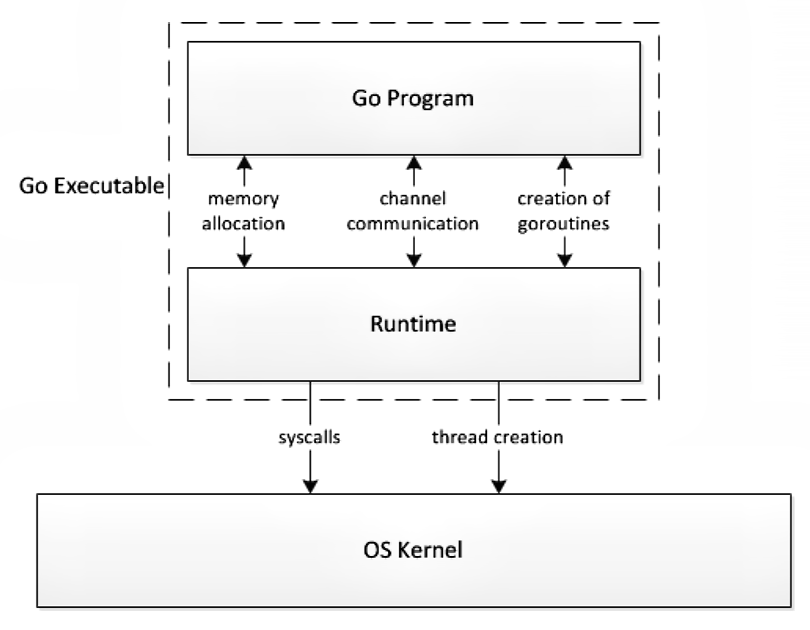
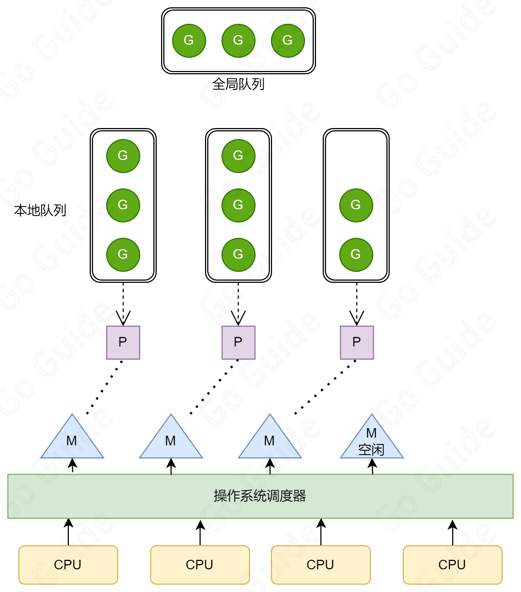
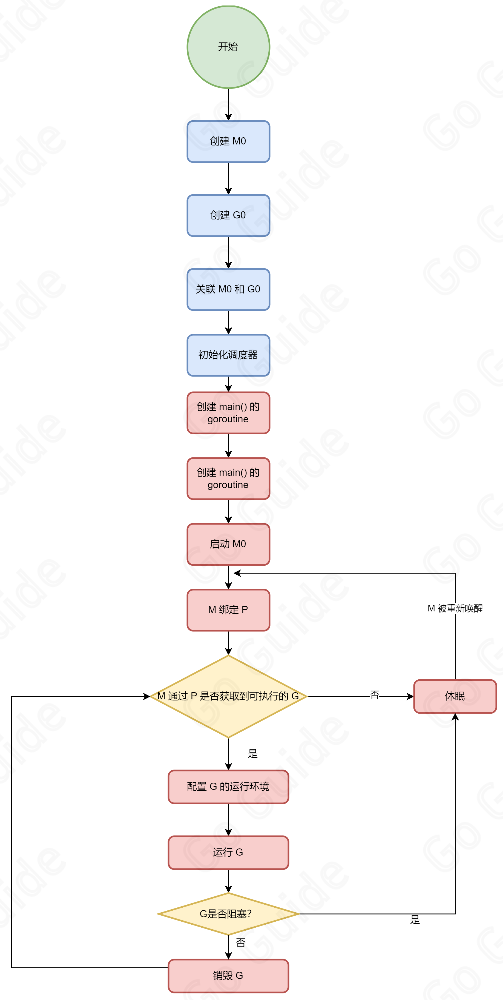

## Scheduler

OS 内核和我们实际写的逻辑代码之间由 `runtime` 提供交互关系，`runtime` 调用 OS 的系统调用，OS 调用硬件资源，然后我们的程序得以运行。

Scheduler 即 负责调度 Goroutine 的模块，它根据一定的策略调度 Goroutine 的执行，保证 Goroutine 的执行顺序和并发度。

这个过程使用的模型即为 GMP 模型。

## GMP 模型

GMP 模型是 Golang 调度器的核心模型，是 Golang 调度器的基础。

GMP (Goroutine - Machine - Processor)：

- Goroutine: 一个协程，包括栈及相关的上下文信息。
- Machine: 一个执行线程，负责将 Goroutine 映射到 OS 的线程上，每个 Machine 都有自己的调用栈和寄存器状态。
- Processor: 一个逻辑处理器，维护一个处于可运行状态的 Goroutine 队列，每个 Machine 都与一个 Processor 关联。

如图：

- **全局队列(GRQ)**：存放所有正在等待运行的 Goroutine 的队列。
- **本地队列(LRQ)**：存放当前 Processor 的可运行(包括正在运行和处于等待中)的 Goroutine 的队列，每个 Processor 都拥有一个本地队列，每个本地队列最大可以存放 **256** 个 Goroutine。

在 Goroutine 创建时会优先置于本地队列，本地队列存满时取出一半加入到全局队列。

需要注意的是： Processor 的数量是固定的，由最大并发数决定，而 Machine 的数量是动态的，由调度器确定，根据当前负载情况动态调整。

Machine 运行任务时需要获取 Processor，否则 Machine 会堵塞，如果 Processor 的本地队列为空，则 Machine 会从全局队列中获取 Goroutine 放入其对应的本地队列，如果全局队列为空，则随机从一个 Processor 的本地队列取出一半 Goroutine 放入对应 Processor 的本地队列。

## 调度器策略

### 抢占式调度

对于 Goroutine，需要一个 Goroutine 让出 CPU 后下一个 Goroutine 才能使用 CPU。

而 Golang 中规定每个 Goroutine 每次最多只能占用 **10ms** CPU，然后切换到其他 Goroutine，以此防止其他 Goroutine 长时间处于等待状态而不被执行。

### 复用线程

Golang 的调度器会复用线程，而非每次创建新的线程，减少了线程创建和销毁的开销，有效提高性能。
- 工作偷取(Working Stealing)：就像前面 "GMP模型" 部分提到的：当 Machine 没有可运行的 Goroutine 时，会尝试随机偷取其他 Processor 的本地队列内容，而非销毁 Machine。
- 挂起机制(hand Off)：当 Goroutine 因为系统调用的原因阻塞时，Machine 会释放与其对应的 Processor 供给其他 Machine 使用。

### 并行

通过最大并发数决定 Processor 的数量，实现并行执行，Processor 的数量决定了并行度，Processor 的数量等于 CPU 核心数时实现最大并行度。

### 全局队列

参见复用线程策略的**工作偷取**机制：

本地队列中没有可运行的 Goroutine 时， Machine 优先在全局队列尝试获取新的 Goroutine， 若全局队列中没有待运行状态的 Goroutine，则尝试偷取其他 Processor 对应的本地队列中的 Goroutine。

## GMP 调度流程

创建一个 Goroutine 时，如果存在未满的本地队列，则随机放入一个未满的本地队列，否则放入全局队列。

执行 Goroutine 时，Processor 获取一个 Goroutine 在 Machine 中执行，如果此时 Goroutine 发生 `SystemCall` 导致的堵塞，则将 Machine 放入休眠队列，同时从中取出一个新的 Machine 接管 Processor 执行，如果休眠队列为空，则创建一个新的 Machine 用于接管。

获取 Goroutine 的机制即 "工作偷取" 机制。

## Machine 的生命周期

参见：

其中：

- `M0`：主线程创建的第一个线程，负责创建和运行第一个 `Goroutine`，存储在 `runtime.m0` 中，不需要在堆上分配。
- `G0`：`M0` 创建之后立即创建一个 `Goroutine` 称为 `G0`，仅用于调度 `Goroutine`，不执行逻辑代码

`G0` 和 `M0` 相对应。