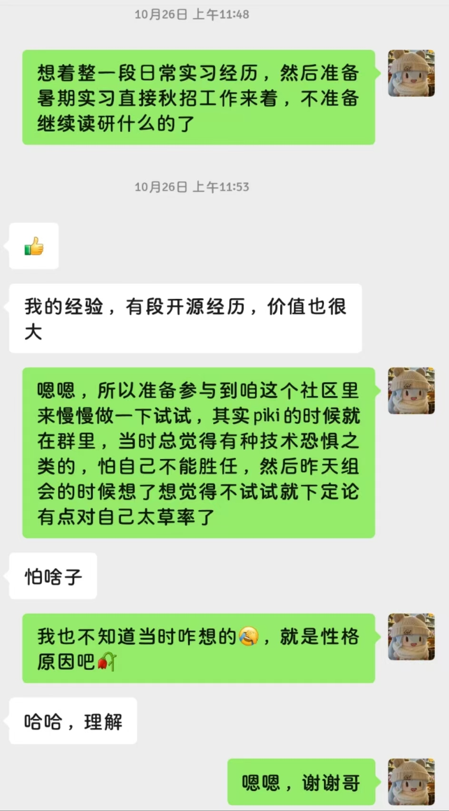
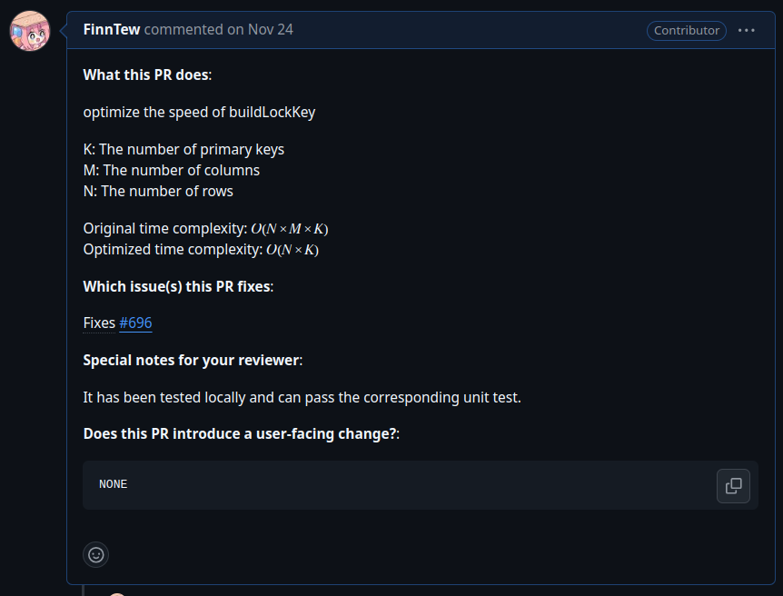
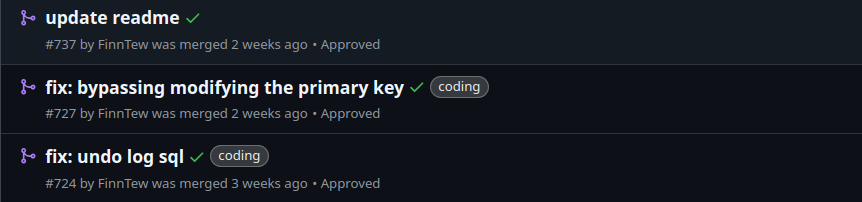
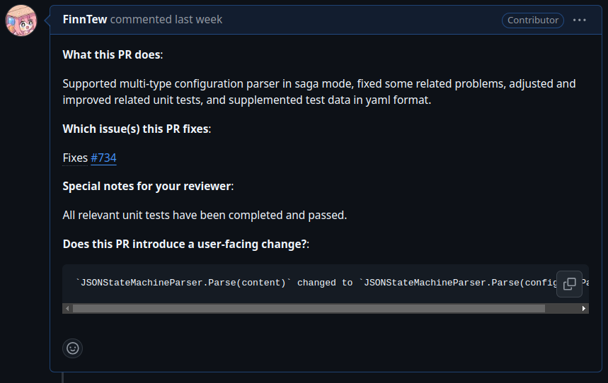
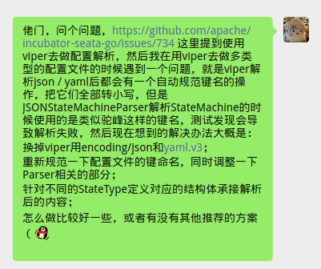
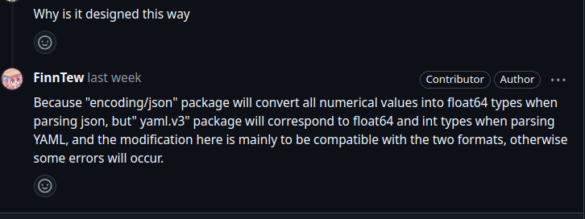

今天早上终于考完了该亖的操作系统期末，记录以下最近刚刚开始的开源贡献之旅 ～

如果以前大胆一些的话应该一年前就已经开始了吧（后悔实录...逃）。

早在去年年末的时候就有机会参与开源，但因为自己说不清的技术恐惧一拖再拖，直到今年 10 月底才开始自己在 [Apache Seata-Go](https://github.com/apache/incubator-seata-go) 项目的第一次贡献。

刚开始参与进来大概只是因为年底找实习体验实在不好，想以此丰富一下简历，后来随着不断学习和贡献的过程，逐渐被社区氛围所吸引，开始意识到这本身就是一件非常有意义的事情。

## 第一次贡献

开始的前几周只是参与了社区周会，并没有做什么实际的贡献，大多时间在熟悉代码和相关的 Samples 上。

直到 11.24 才第一次提交了代码，优化 `buildLockKey` 的时间复杂度，因为基本没有和别的逻辑相关联，对于新手来说比较友好。

仅仅是通过预处理的方式将时间复杂度从 $O(N \times M \times K)$ 降低到 $O(N \times K)$ 。

在这之后就是基本保持在一周提交一个 PR 的频率，做了一些简单的 bug fix 和 更新文档 的工作。

## 参与实现的第一个 feature

在最近几周社区开始了对 Saga 模式的支持，我也开始了自己的第一个 feature 任务：为 Saga 支持多类型配置。

最初的想法是使用 `Viper` 来支持，但是实现时发现 `Viper` 在解析 `json` 和 `yaml` 时会自动的进行键名规范(模糊大小写，将其全部转化为小写)，但已有的 Saga StateMachine Parser 的实现是不模糊大小写的。

所以需要进行一些修改，交流确认后决定使用 `encoding/json` 和 `yaml.v3` 代替掉 `Viper` 。

然后需要对 State Machine Parser 进行简单调整以兼容两种格式，因为 `encoding/json` 和 `yaml.v3` 对数值的解析实现不同：

之后修复了一些导致 State Machine Parser 解析失败的 bug，以及对 Config Parser 和 State Machine Parser 进行单测完善。

(由于最近期末周的原因，State Machine Parser 的单测还没有修改完善）等期末结束后写完提交再调整一下细节大概就结束力！

That's all!