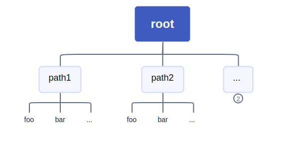

我们不难想到，对于路由的组织可以按照如下的树状结构：



对于每个结点，其子结点拥有相同的前缀。

这一点和 *Trie* (字典树/前缀树) 不谋而合。

所以我们可以考虑用 *Trie* 来实现一个基础的路由树。

## Trie 实现

### 结构定义

对于一个基本的 Trie 结点，我们可以这样定义：

```go
type TreeNode struct {
	next map[rune]*TreeNode
	val rune
	isEnd bool
}
```

但是，对于路由来说，我们需要记录更多的信息，比如最基本的：

- 为了实现动态路由，我们需要记录路由参数，比如：`/user/:id` 中的 `:id`，所以，我们需要记录一下路由参数的键。
- 对于每个路径，我们希望它绑定到一个具体的处理方法，比如：`/user/:id` 绑定到 `UserMethod`。

所以对于一个基本的路由树结点，定义如下: 

```go
type TreeNode struct {
	next     map[rune]*TreeNode
	val      rune
	isEnd    bool
	method   MethodType
	paramKey string
}
```

完整的定义部分：

```go
type MethodType func(params map[string]string) error

type TreeNode struct {
	next     map[rune]*TreeNode
	val      rune
	isEnd    bool
	method   MethodType
	paramKey string
}

type Router struct {
	root *TreeNode
}

func newTreeNode(val rune) *TreeNode {
	return &TreeNode{
		next:     make(map[rune]*TreeNode),
		val:      val,
		isEnd:    false,
		method:   nil,
		paramKey: "",
	}
}

func NewRouter() *Router {
	return &Router{
		root: newTreeNode('+'),
	}
}
```

### 插入路由

插入路由的过程就是向Trie树中插入新的字符串的过程。

不同之处在于，对于路径的处理，我们需要一些额外的处理，包括分割符和动态参数的键。

参照上文结构定义，显然，分割符在树的结构上已经有所体现，不需要单独占用结点，而对于动态参数，我们只需要一个结点记录通配符 `:`，标记该位置为动态参数即可，而不需要为键名新建结点。

明确了这些，就可以大胆 *Coding* 了。

```go
func (t *Router) Add(path string, method MethodType) error {
	if method == nil {
		return errors.New("method cannot be nil")
	}
	curr := t.root
	// 分割路径
	parts := strings.Split(strings.Trim(path, "/"), "/")
	for _, part := range parts {
		if part == "" {
			continue
		}
		// 动态参数，处理通配符
		if part[0] == ':' {
			if _, ok := curr.next[':']; !ok {
				curr.next[':'] = newTreeNode(':') // 创建通配符结点
			}
			curr = curr.next[':']
			curr.paramKey = part[1:] // 记录参数键名
		} else {
			// 静态参数，处理常规路径字符
			for _, char := range part {
				if _, ok := curr.next[char]; !ok {
					curr.next[char] = newTreeNode(char)
				}
				curr = curr.next[char]
			}
		}
	}
	// 绑定方法
	curr.isEnd = true
	curr.method = method
	return nil
}
```

### 查找路由

查找也是同理，和插入不同的是，我们需要记录动态参数的值，以供给绑定的 `Method` 使用。

处理方式也很简单，匹配时遇到通配符结点就跳过，并记录参数值，其余情况就正常匹配即可。

```go
func (t *Router) Search(path string) error {
	curr := t.root
	params := make(map[string]string)
	// 分割路径
	parts := strings.Split(strings.Trim(path, "/"), "/")
	// 匹配路径
	for _, part := range parts {
		if part == "" {
			continue
		}
		// 处理常规路径匹配
		if next, ok := curr.next[rune(part[0])]; ok {
			curr = next
			for _, char := range part[1:] {
				if next, ok := curr.next[char]; ok {
					curr = next
				} else {
					return errors.New("path not found")
				}
			}
		} else if next, ok := curr.next[':']; ok { // 处理动态参数，通配符匹配
			curr = next
			params[curr.paramKey] = part // 记录参数值
		} else {
			return errors.New("path not found")
		}
	}
	if !curr.isEnd { // 判断是否为完整路径
		return errors.New("path not found")
	}
	if err := curr.method(params); err != nil {
		return err
	}
	return nil
}
```

### 一些思考

可以发现，直接套用Trie实现的话，路径的每个part占用整条链的其中一部分，查找时不可避免的需要遍历整条链，每次的查找深度都是 $len(path)$。

我们结合文章开始的图片 "Image 1" 可以想到：

对于路由树来说，类似 "app", "apple", "art" 形成的如下树形结构：

```markdown
+ root
  - a
    - p
      - p
        - ...
      - p
        - l
          - e
            - ...
    - r
      - t
        - ...
```

显然查找效率不如：

```markdown
+ root
  - app
    - part...
  - art
    - part...
  - apple
    - part...
```

## 优化

结合上面提到的思路，我们不难想到，将路径的每个part作为一个结点。

查找和插入的深度都会降低到 $Cnt_{part}(path)$。

### 结构调整

```go
type MethodType func(params map[string]string) error

type TreeNode struct {
	next     map[string]*TreeNode // 字符结点 -> 路径片段结点
	segment  string // 字符 -> 路径片段
	isEnd    bool
	method   MethodType
	paramKey string
}

type Router struct {
	root *TreeNode
}

func newTreeNode(segment string) *TreeNode {
	return &TreeNode{
		segment: segment,
		next:    make(map[string]*TreeNode),
	}
}

func NewRouter() *Router {
	return &Router{root: newTreeNode("")}
}
```

### 插入路由

```go
func (r *Router) Add(path string, method MethodType) error {
	if method == nil {
		return errors.New("method cannot be nil")
	}
	// 分割路径
	parts := strings.Split(strings.Trim(path, "/"), "/")
	node := r.root
	for _, part := range parts {
		key := part
		if strings.HasPrefix(part, ":") {
			key = ":"
		}
		// 创建结点
		if _, exists := node.next[key]; !exists {
			node.next[key] = newTreeNode(part)
		}
		node = node.next[key]
		// 记录参数键名
		if strings.HasPrefix(part, ":") {
			node.paramKey = strings.TrimPrefix(part, ":")
		}
	}
	// 绑定方法
	node.isEnd = true
	node.method = method
	return nil
}
```

### 查找路由

```go
func (r *Router) Search(path string) error {
	// 分割路径
	parts := strings.Split(strings.Trim(path, "/"), "/")
	node := r.root
	params := make(map[string]string)
	// 匹配路径
	for _, part := range parts {
		if nextNode, exists := node.next[part]; exists { // 静态参数匹配
			node = nextNode
		} else if nextNode, exists := node.next[":"]; exists { // 动态参数匹配
			node = nextNode
			params[node.paramKey] = part
		} else { // 匹配失败
			return errors.New("path not found")
		}
	}
	// 判断是否为完整路径
	if node.isEnd {
		return node.method(params)
	}
	return errors.New("path not found")
}
```